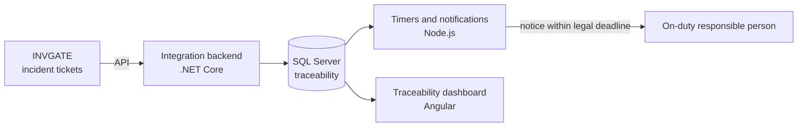

# SITRAC-ANCI

**Cybersecurity Incident Traceability and Automatic Notification System for ANCI**

[](#-status-and-timeline)
[](#-methodology)
[](#-context-and-problem)

[🇪🇸 Español](README.md) · 🇬🇧 English

> CAPSTONE project (PTY4614) for the Computer Engineering program at DuocUC – School of Informatics and Telecommunications, Valparaíso campus. Developed together with the sponsoring company **UltraPort**.

---

## 📑 Table of contents

1. [Summary](#-summary)
2. [Context and problem](#-context-and-problem)
3. [Proposed solution](#-proposed-solution)
4. [Objectives](#-objectives)
5. [Scope and limitations](#-scope-and-limitations)
6. [Tech stack and architecture](#-tech-stack-and-architecture)
7. [Methodology](#-methodology)
8. [Team and roles](#-team-and-roles)
9. [Status and timeline](#-status-and-timeline)
10. [Repository structure](#-repository-structure)
11. [References](#-references)

---

## 📌 Summary

UltraPort, a port operations company, is required under Chilean **Law N° 21.663** to notify every cybersecurity incident to the **National Cybersecurity Agency (ANCI)**. SITRAC-ANCI is a system that consumes tickets already existing in the **INVGATE** platform, centralizes traceability in a dedicated database, and **automatically notifies the on-duty responsible person** within the legal deadline.

## ⚖️ Context and problem

Law N° 21.663 requires cybersecurity incidents to be notified to ANCI within the following deadlines:

| Milestone | Deadline |
| --- | --- |
| Initial notification | Maximum of **3 hours** from the moment of awareness |
| Update report | **72 hours** |
| Final report | **15 days** |

Today, detection and notification rely on scattered channels (SOC, firewalls, emails, INVGATE tickets), with no unified, traceable mechanism to guarantee compliance with these deadlines.

A recent precedent made this clear: a proactive warning from ANCI itself about a compromised firewall, indirectly linked to UltraPort, did not result in a ticket or in formal traceability. This exposes the company to a real risk of regulatory non-compliance.

## 💡 Proposed solution

A system that:

1. **Consumes** the existing security incident tickets in INVGATE through its API.
2. **Centralizes** the information and its traceability in a dedicated database.
3. **Automatically notifies** the on-duty responsible person within the critical deadlines set by the regulation.
4. **Records evidence** of every notice sent and of ANCI's response, including false positives.

## 🎯 Objectives

**General objective**

To automate the traceability and notification of UltraPort's cybersecurity incidents to ANCI, ensuring compliance with the deadlines established by Law N° 21.663.

**Specific objectives**

- Consume and centralize, via the INVGATE API, the information from existing security incident tickets.
- Implement a dedicated database (SQL Server, migrations with Evolve) that centralizes traceability.
- Automatically notify the on-duty responsible person within the critical deadlines required by the regulation.
- Record evidence of every notice sent and of ANCI's response, including false positives.
- Deploy and document the system in accordance with UltraPort's security standards.

## 🔎 Scope and limitations

**Scope**

- MVP limited to one specific incident traceability and notification flow to ANCI, within the 18 weeks of CAPSTONE (August 10 to December 12, 2026).
- Integration with the INVGATE API and deployment on UltraPort's own servers, **with no internet exposure**.
- Technology stack already defined by the organization.

**Limitations**

- The sponsor warned that the full scope will likely require more than one iteration; this is mitigated by limiting the MVP to a well-defined flow.
- Dependence on technical baselines from UltraPort (SRS and architecture diagrams), still pending at the time of the Phase 1 report.
- The current working schedule is 2 hours per day; the move to office hours (9:00–17:00) for intensive development has not yet been formalized with UltraPort or the internship coordination.

## 🛠️ Tech stack and architecture

| Technology | Role in the project |
| --- | --- |
| **.NET Core** | Integration backend with INVGATE |
| **Node.js** | Timers and notification flows |
| **Angular** | Traceability and notifications dashboard |
| **SQL Server** | Dedicated database, with migrations through Evolve |
| **INVGATE API** | Source of incident tickets |
| **Microsoft accounts** | Authentication |

**General flow (preliminary, subject to validation with UltraPort's technical baselines):**



> Deployed on UltraPort's own servers, with no internet exposure.

## 🔄 Methodology

The project follows **Scrum**, with sprints aligned to the CAPSTONE weeks:

1. Requirements gathering and formalization (SRS following the IEEE 830 standard).
2. Architecture and data model design.
3. Iterative development of the INVGATE integration backend.
4. Testing, documentation, and final presentation.

**Why Scrum?**

- It allows incorporating, sprint by sprint, the information that UltraPort provides progressively.
- The sponsor already anticipated more than one iteration, which fits the incremental model.
- The team holds a SCRUM-ITF certification.

**Discarded methodologies:** the traditional approach (SDLC/RUP) demands heavy upfront formal documentation, which is incompatible with requirements that evolve in every meeting; Design Thinking focuses on end-user empathy and does not apply to a backend integration driven by regulatory requirements.

## 👥 Team and roles

| Member | Role | Responsibilities |
| --- | --- | --- |
| **Rodrigo Ayala López** | Project Management and Regulatory Compliance | Backlog management, monitoring of the regulation (Law N° 21.663), coordination with UltraPort, and sprint facilitation |
| **Benjamín Soto Aguilar** | Backend Development | Integration backend (INVGATE API and timers), system architecture, and testing |

Both members take part in communication flows, architecture, testing, retrospectives, and presentations.

- **Sponsoring company:** UltraPort (counterparts: Enzo Vadillo and Gonzalo Crosier)
- **Guiding professor:** María Ignacia Cobo

## 📅 Status and timeline

| Phase | Content | Status |
| --- | --- | --- |
| **Phase 1** | APT project definition: Product Backlog, supporting SRS, technical report, and project idea presentation | ✅ Completed |
| **Phase 2** | Development: Sprint 1 (UltraPort parameters, database, and work environment) and Sprint 2 (backend, INVGATE API, and notifications), plus Sprint Review and progress report | 🚧 In progress |
| **Phase 3** | Certification tests and project closure | ⏳ Pending |

Documentation for Phases 2 and 3 will be published in this repository as the project progresses.

## 📂 Repository structure

```text
.
├── Fase 1/                       # Phase 1
│   ├── Evidencias Grupales/      # Team evidence: technical report, presentation, phase guide
│   └── Evidencias Individuales/  # Individual self-assessments and reflection journals
├── Fase 2/                       # Phase 2 – in progress
├── Fase 3/                       # Phase 3 – pending
├── README.md                     # Spanish version
└── README.en.md                  # English version
```

**Main Phase 1 documents** (in [`Fase 1/Evidencias Grupales`](<Fase 1/Evidencias Grupales>)):

- Technical report "APT Project Definition – Phase 1" (August 30, 2026).
- Presentation "SITRAC-ANCI – Phase 1: Project idea presentation".
- Phase 1 student guide (Spanish and English) and evaluation sheet.

## 📚 References

- Ministerio del Interior y Seguridad Pública. (2024, April 8). *Ley 21.663: Ley marco de ciberseguridad e infraestructura crítica de la información*. Diario Oficial de la República de Chile. https://www.bcn.cl/leychile/navegar?idNorma=1202434
- Agencia Nacional de Ciberseguridad. (n.d.). *ANCI*. Government of Chile. https://www.anci.gob.cl/
- Schwaber, K., & Sutherland, J. (2020). *The Scrum Guide*. https://scrumguides.org/
- INVGATE. (n.d.). *INVGATE Service Desk*. https://www.invgate.com/

---

<sub>Academic project developed as part of the professional internship and CAPSTONE course, DuocUC Valparaíso campus, with the sponsoring company UltraPort.</sub>
