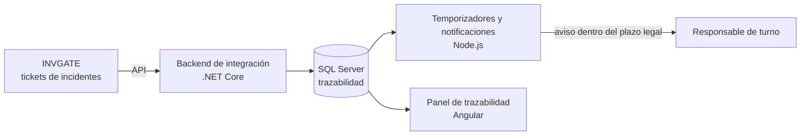

[README.md](https://github.com/user-attachments/files/32878150/README.md)
# SITRAC-ANCI

**Sistema de Trazabilidad y Notificación Automática de Incidentes de Ciberseguridad a la ANCI**

[](#-estado-y-cronograma)
[](#-metodología)
[](#-contexto-y-problema)

🇪🇸 Español · [🇬🇧 English](README.en.md)

> Proyecto CAPSTONE (PTY4614) de Ingeniería en Informática, DuocUC – Escuela de Informática y Telecomunicaciones, sede Valparaíso. Desarrollado en conjunto con la empresa mandante **UltraPort**.

---

## 📑 Tabla de contenidos

1. [Resumen](#-resumen)
2. [Contexto y problema](#-contexto-y-problema)
3. [Solución propuesta](#-solución-propuesta)
4. [Objetivos](#-objetivos)
5. [Alcances y limitaciones](#-alcances-y-limitaciones)
6. [Stack tecnológico y arquitectura](#-stack-tecnológico-y-arquitectura)
7. [Metodología](#-metodología)
8. [Equipo y roles](#-equipo-y-roles)
9. [Estado y cronograma](#-estado-y-cronograma)
10. [Estructura del repositorio](#-estructura-del-repositorio)
11. [Referencias](#-referencias)

---

## 📌 Resumen

UltraPort, empresa de operaciones portuarias, está obligada por la **Ley N° 21.663** a notificar todo incidente de ciberseguridad a la **Agencia Nacional de Ciberseguridad (ANCI)**. SITRAC-ANCI es un sistema que consume los tickets ya existentes en la plataforma **INVGATE**, centraliza la trazabilidad en una base de datos propia y **notifica automáticamente al responsable de turno** dentro del plazo legal.

## ⚖️ Contexto y problema

La Ley N° 21.663 exige notificar los incidentes de ciberseguridad a la ANCI en los siguientes plazos:

| Hito | Plazo |
| --- | --- |
| Notificación inicial | Máximo **3 horas** desde la toma de conocimiento |
| Reporte de actualización | **72 horas** |
| Informe final | **15 días** |

Hoy la detección y el aviso dependen de canales dispersos (SOC, firewalls, correos, tickets de INVGATE), sin un mecanismo unificado ni trazable que garantice el cumplimiento de estos plazos.

Un antecedente reciente lo evidenció: un aviso proactivo de la propia ANCI sobre un firewall vulnerado, vinculado indirectamente a UltraPort, no derivó en un ticket ni en trazabilidad formal. Esto expone a la empresa a un riesgo real de incumplimiento normativo.

## 💡 Solución propuesta

Un sistema que:

1. **Consume** los tickets de incidentes de seguridad existentes en INVGATE mediante su API.
2. **Centraliza** la información y su trazabilidad en una base de datos propia.
3. **Notifica automáticamente** al responsable de turno dentro de los plazos críticos de la normativa.
4. **Registra la evidencia** de cada aviso enviado y de la respuesta de la ANCI, incluyendo falsos positivos.

## 🎯 Objetivos

**Objetivo general**

Automatizar la trazabilidad y notificación de incidentes de ciberseguridad de UltraPort a la ANCI, garantizando el cumplimiento de los plazos establecidos por la Ley N° 21.663.

**Objetivos específicos**

- Consumir y centralizar, vía API de INVGATE, la información de tickets de incidentes de seguridad ya existentes.
- Implementar una base de datos propia (SQL Server, migraciones con Evolve) que centralice la trazabilidad.
- Notificar automáticamente al responsable de turno dentro de los plazos críticos exigidos por la normativa.
- Registrar la evidencia de cada aviso enviado y de la respuesta de la ANCI, incluyendo falsos positivos.
- Desplegar y documentar el sistema conforme a los estándares de seguridad de UltraPort.

## 🔎 Alcances y limitaciones

**Alcances**

- MVP acotado a un flujo específico de trazabilidad y notificación de incidentes a la ANCI, dentro de las 18 semanas de CAPSTONE (10 de agosto al 12 de diciembre de 2026).
- Integración con la API de INVGATE y despliegue en servidores propios de UltraPort, **sin exposición a internet**.
- Stack tecnológico ya definido por la organización.

**Limitaciones**

- El mandante advirtió que el alcance completo probablemente requiera más de una iteración; se mitiga acotando el MVP a un flujo bien definido.
- Dependencia de la entrega de bases técnicas por parte de UltraPort (ERS y diagramas de arquitectura), pendiente a la fecha del informe de la Fase 1.
- La jornada actual es de 2 horas diarias; la migración a jornada de oficina (9:00–17:00) para el desarrollo intensivo aún no está formalizada con UltraPort ni con la coordinación de práctica.

## 🛠️ Stack tecnológico y arquitectura

| Tecnología | Uso en el proyecto |
| --- | --- |
| **.NET Core** | Backend de integración con INVGATE |
| **Node.js** | Temporizadores y flujos de notificación |
| **Angular** | Panel de trazabilidad y notificaciones |
| **SQL Server** | Base de datos propia, con migraciones mediante Evolve |
| **API de INVGATE** | Origen de los tickets de incidentes |
| **Cuentas Microsoft** | Autenticación |

**Flujo general (preliminar, sujeto a validación con las bases técnicas de UltraPort):**



> Despliegue en servidores propios de UltraPort, sin exposición a internet.

## 🔄 Metodología

El proyecto se desarrolla con **Scrum**, con sprints alineados a las semanas de CAPSTONE:

1. Levantamiento y formalización de requisitos (ERS bajo el estándar IEEE 830).
2. Diseño de arquitectura y modelo de datos.
3. Desarrollo iterativo del backend de integración con INVGATE.
4. Pruebas, documentación y presentación final.

**¿Por qué Scrum?**

- Permite incorporar en cada sprint la información que UltraPort entrega de forma progresiva.
- El mandante ya anticipó más de una iteración, lo que calza con el modelo incremental.
- El equipo cuenta con certificación SCRUM-ITF.

**Metodologías descartadas:** el enfoque tradicional (SDLC/RUP) exige mucha documentación formal previa, incompatible con requisitos que evolucionan en cada reunión; Design Thinking está orientado a la empatía con el usuario final y no aplica a una integración backend gobernada por requisitos normativos.

## 👥 Equipo y roles

| Integrante | Rol | Responsabilidades |
| --- | --- | --- |
| **Rodrigo Ayala López** | Gestión de Proyecto y Cumplimiento Normativo | Gestión del backlog, seguimiento de la normativa (Ley N° 21.663), coordinación con UltraPort y facilitación de sprints |
| **Benjamín Soto Aguilar** | Desarrollo Backend | Backend de integración (API de INVGATE y temporizadores), arquitectura y pruebas del sistema |

Ambos participan en los flujos de comunicación, la arquitectura, las pruebas, las retrospectivas y las presentaciones.

- **Empresa mandante:** UltraPort (contrapartes: Enzo Vadillo y Gonzalo Crosier)
- **Docente guía:** María Ignacia Cobo

## 📅 Estado y cronograma

| Fase | Contenido | Estado |
| --- | --- | --- |
| **Fase 1** | Definición del proyecto APT: Product Backlog, ERS de apoyo, informe técnico y presentación de la idea de proyecto | ✅ Completada |
| **Fase 2** | Desarrollo: Sprint 1 (parámetros de UltraPort, base de datos y entorno de trabajo) y Sprint 2 (backend, API de INVGATE y notificaciones), más Sprint Review e informe de avance | 🚧 En desarrollo |
| **Fase 3** | Pruebas de certificación y cierre del proyecto | ⏳ Pendiente |

La documentación de las Fases 2 y 3 se irá publicando en este repositorio a medida que avance el proyecto.

## 📂 Estructura del repositorio

```text
.
├── Fase 1/
│   ├── Evidencias Grupales/      # Informe técnico, presentación y guía de la fase
│   └── Evidencias Individuales/  # Autoevaluaciones y diarios de reflexión de cada integrante
├── Fase 2/                       # En desarrollo
├── Fase 3/                       # Pendiente
├── README.md                     # Versión en español
└── README.en.md                  # English version
```

**Documentos principales de la Fase 1** (en [`Fase 1/Evidencias Grupales`](<Fase 1/Evidencias Grupales>)):

- Informe técnico «Definición del Proyecto APT – Fase 1» (30 de agosto de 2026).
- Presentación «SITRAC-ANCI – Fase 1: Exposición de la idea de proyecto».
- Guía del estudiante de la Fase 1 (español e inglés) y planilla de evaluación.

## 📚 Referencias

- Ministerio del Interior y Seguridad Pública. (2024, 8 de abril). *Ley 21.663: Ley marco de ciberseguridad e infraestructura crítica de la información*. Diario Oficial de la República de Chile. https://www.bcn.cl/leychile/navegar?idNorma=1202434
- Agencia Nacional de Ciberseguridad. (s.f.). *ANCI*. Gobierno de Chile. https://www.anci.gob.cl/
- Schwaber, K., & Sutherland, J. (2020). *The Scrum Guide*. https://scrumguides.org/
- INVGATE. (s.f.). *INVGATE Service Desk*. https://www.invgate.com/

---

<sub>Proyecto académico desarrollado en el marco de la práctica profesional y CAPSTONE, DuocUC sede Valparaíso, con la empresa mandante UltraPort.</sub>
